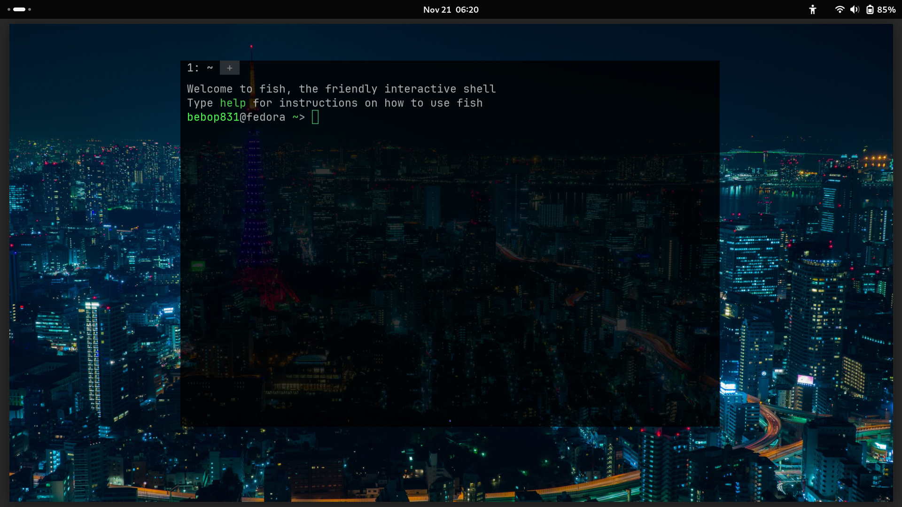

# WezTermConfig
My config file for wezterm

Install: Place file in HOME directory and change to hidden file naming scheme.

```
git clone https://github.com/b3b0p831/WezTermConfig/edit/main/README.md
cd WezTermConfig/
cp wezterm.lua ~/.wezterm.lua
```
## Screenshots

